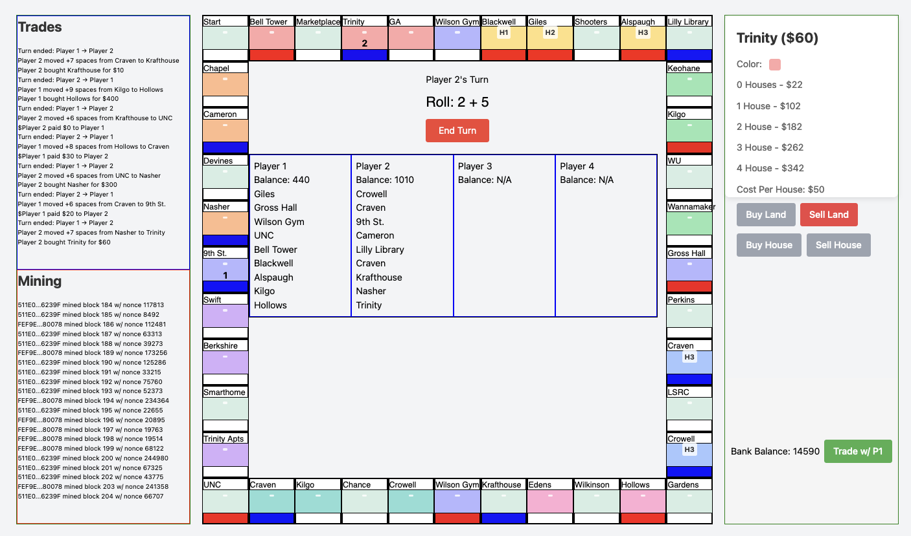

# 🍃 Blade

Blade is a JavaScript library that allows you to build blockchains from scratch and use them for whatever you want. You can create a lightweight and flexible blockchain following the Bitcoin protocol, with support for hierarchical wallets, ECC/RSA encryption (the random number generations are NOT cryptographically secure yet!), transaction handling, and asynchronous mining with adaptive difficulty. 

I've recently got into Monopoly, and so I implemented an application of it by coding the board game up where all the transactions are on this custom blockchain. This is done using React. 



Here is a quick demo of the backend. 
```
  import { BlockChain, BtcWallet, Miner, Hex } from "./index.js";

  // initialize difficulty and reward for mining a block 
  const difficulty = new Hex("0000500000000003A30C00000000000000000000000000000000000000000000");  
  const reward = 10n;

  // initialize blockchain
  const blockchain = new BlockChain(difficulty, reward);

  // create some wallets with their respective miners. 
  const M = BtcWallet.random();
  const S = BtcWallet.random();
  const M_miner = new Miner(M.master_keypair.public, blockchain); 
  const S_miner = new Miner(S.master_keypair.public, blockchain); 
  blockchain.add_miner(M_miner);
  blockchain.add_miner(S_miner);

  // start the asynchronous mining
  M_miner.start();
  S_miner.start();

  // give some time to accumulate money through mining first few blocks 
  await new Promise(resolve => setTimeout(resolve, 2000)); 

  // every 1 second, we conduct a transaction 
  setInterval(() => {
    // creates transactions 
    let tx1 = M.send(S.master_keypair.public, BigInt(Math.floor(Math.random() * 5))); 
    let tx2 = S.send(M.master_keypair.public, BigInt(Math.floor(Math.random() * 5)));   
   
    // sends them to the blockchain, the TXIs are used and are "pending" in the blockchain
    blockchain.add_transaction(tx1); 
    blockchain.add_transaction(tx2); 

    console.log(`M : ${M.balance()}, S : ${S.balance()}, Pending : ${blockchain.pending_withheld()}`); 
    console.log(`Total Coins in Circulation : Num Blocks Mined * Reward = ${Number(reward) * (blockchain.chain.length-1)}`)

    // Once the new block is mined, all pending transactions are flushed and the 
    // receiver gets the coins
  }, 1000); 
```

This results in the following output over 10 seconds. The production and rate of transfer can all be modified of course.  
```
  E2880...61E53             mined block #1 with nonce 33854.
  E2880...61E53             mined block #2 with nonce 31319.
  E2880...61E53             mined block #3 with nonce 62930.
  EC267...36BBB             mined block #4 with nonce 380289.
  EC267...36BBB             mined block #5 with nonce 69127.
  E2880...61E53             mined block #6 with nonce 338878.
  EC267...36BBB             mined block #7 with nonce 71993.
  EC267...36BBB             mined block #8 with nonce 43583.
  E2880...61E53             mined block #9 with nonce 73465.
  EC267...36BBB             mined block #10 with nonce 20841.
  E2880...61E53             mined block #11 with nonce 212312.
  E2880...61E53             mined block #12 with nonce 186832.
  EC267...36BBB             mined block #13 with nonce 520787.
  E2880...61E53             mined block #14 with nonce 73257.
  E2880...61E53             mined block #15 with nonce 6229.
  M : 80, S : 50, Pending : 20
  Total Coins in Circulation : Num Blocks Mined * Reward = 150
  EC267...36BBB             mined block #16 with nonce 219039.
  E2880...61E53             mined block #17 with nonce 213917.
  EC267...36BBB             mined block #18 with nonce 12101.
  EC267...36BBB             mined block #19 with nonce 55568.
  EC267...36BBB             mined block #20 with nonce 24194.
  M : 88, S : 92, Pending : 20
  Total Coins in Circulation : Num Blocks Mined * Reward = 200
  E2880...61E53             mined block #21 with nonce 334637.
  EC267...36BBB             mined block #22 with nonce 164212.
  E2880...61E53             mined block #23 with nonce 134449.
  E2880...61E53             mined block #24 with nonce 133824.
  M : 116, S : 104, Pending : 20
  Total Coins in Circulation : Num Blocks Mined * Reward = 240
  EC267...36BBB             mined block #25 with nonce 356452.
  EC267...36BBB             mined block #26 with nonce 86101.
  E2880...61E53             mined block #27 with nonce 284605.
  EC267...36BBB             mined block #28 with nonce 143735.
  E2880...61E53             mined block #29 with nonce 2559.
  M : 138, S : 132, Pending : 20
  Total Coins in Circulation : Num Blocks Mined * Reward = 290
  E2880...61E53             mined block #30 with nonce 93114.
  E2880...61E53             mined block #31 with nonce 168202.
  E2880...61E53             mined block #32 with nonce 11073.
  EC267...36BBB             mined block #33 with nonce 374449.
  E2880...61E53             mined block #34 with nonce 18707.
  M : 181, S : 139, Pending : 20
  Total Coins in Circulation : Num Blocks Mined * Reward = 340
  EC267...36BBB             mined block #35 with nonce 142931.
  EC267...36BBB             mined block #36 with nonce 34717.
  EC267...36BBB             mined block #37 with nonce 179372.
  E2880...61E53             mined block #38 with nonce 419923.
  EC267...36BBB             mined block #39 with nonce 59003.
  M : 191, S : 179, Pending : 20
  Total Coins in Circulation : Num Blocks Mined * Reward = 390
  E2880...61E53             mined block #40 with nonce 160051.
  EC267...36BBB             mined block #41 with nonce 177732.
  EC267...36BBB             mined block #42 with nonce 61751.
  E2880...61E53             mined block #43 with nonce 205685.
  E2880...61E53             mined block #44 with nonce 80586.
  M : 222, S : 205, Pending : 13
  Total Coins in Circulation : Num Blocks Mined * Reward = 440
  E2880...61E53             mined block #45 with nonce 268122.
  M : 230, S : 210, Pending : 10
  Total Coins in Circulation : Num Blocks Mined * Reward = 450
  E2880...61E53             mined block #46 with nonce 375018.
  M : 246, S : 205, Pending : 9
  Total Coins in Circulation : Num Blocks Mined * Reward = 460
  EC267...36BBB             mined block #47 with nonce 1156193.
  E2880...61E53             mined block #48 with nonce 319199.
  EC267...36BBB             mined block #49 with nonce 132560.
  E2880...61E53             mined block #50 with nonce 67456.
``` 

We can print out the whole chain as well. 
```
<ref *1> BlockChain {
  chain: [
    Block {
      version: [Hex],
      height: 0,
      prev_block_hash: null,
      txs: [],
      timestamp: 1731485517794,
      merkletree: [MerkleNode],
      difficulty: undefined,
      nonce: 0n,
      id: [Hex]
    },
    Block {
      version: [Hex],
      height: 1,
      prev_block_hash: [Hex],
      txs: [Array],
      timestamp: 1731485517820,
      merkletree: [MerkleNode],
      difficulty: [Hex],
      nonce: 33854n,
      id: [Hex]
    },

    ...

    Block {
      version: [Hex],
      height: 49,
      prev_block_hash: [Hex],
      txs: [Array],
      timestamp: 1731485529044,
      merkletree: [MerkleNode],
      difficulty: [Hex],
      nonce: 132560n,
      id: [Hex]
    },
    Block {
      version: [Hex],
      height: 50,
      prev_block_hash: [Hex],
      txs: [Array],
      timestamp: 1731485529253,
      merkletree: [MerkleNode],
      difficulty: [Hex],
      nonce: 67456n,
      id: [Hex]
    }
  ],
  pending_transactions: [],
  difficulty: Hex {
    stream: '0000500000000003A30C00000000000000000000000000000000000000000000',
    length: 256
  },
  reward: 10n,
  miners: [
    Miner {
      owner_pubkey: [PublicEccKey],
      blockchain: [Circular *1],
      nonce: 218000n,
      isRunning: true,
      signal_next: false
    },
    Miner {
      owner_pubkey: [PublicEccKey],
      blockchain: [Circular *1],
      nonce: 226000n,
      isRunning: true,
      signal_next: false
    }
  ]
}
``` 
